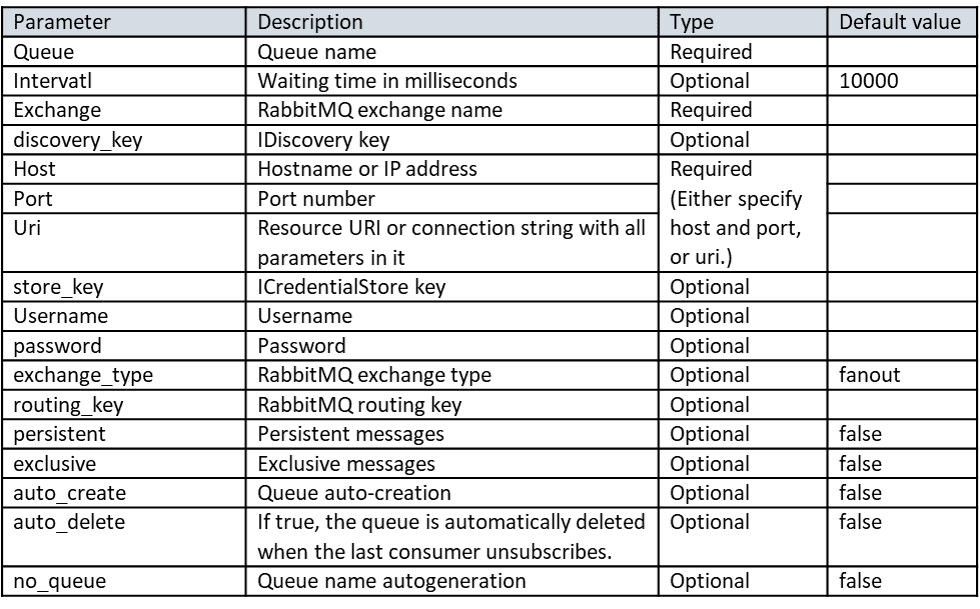



### Key takeaways

<table class="full-width-table">
  <tr>
    <td>RabbitMQMessageQueue</td>
    <td>Component used to send and receive messages via RabbitMQ.</td>
  </tr>
  <tr>
    <td>OpenAsync()</td>
    <td>Method used to connect to RabbitMQ.</td>
  </tr>
  <tr>
    <td>SendAsync()</td>
    <td>Method used to send messages to RabbitMQ.</td>
  </tr>
  <tr>
    <td>ReceiveAsync()</td>
    <td>Method used to receive messages from RabbitMQ.</td>
  </tr>
  <tr>
    <td>queue, exchange, host, port (or uri)</td>
    <td>Required configuration parameters.</td>
  </tr>
</table>

### Introduction

In this tutorial, you will learn how to send and receive messages via RabbitMQ. First, we will see the necessary pre-requisites. Then, we will learn how to implement this component, connect to RabbitMQ and send and receive messages from it. Finally, we will combine the different sections into a program and summarize all the learned concepts.

### The RabbitMQMessageQueue component

This component is part of the RabbitMQ module and represents a message queue that sends and receives messages via the RabbitMQ message broker. Furthermore, it is a subclass of MessageQueue. The following sections explain how to use it.

#### Pre-requisites

In order to use this component, we need to import it first. The following code shows how to do this:


  Not available 



  



 Not available 



 Not available 



 Not available 



  Not available  


#### Implementing our component

First, and after having imported our component, we create an instance of it:


  Not available 



  



 Not available 



 Not available 



 Not available 



  Not available  


#### Configuring our component

After creating an instance of our component, we need to configure it. Here, an important point is to understand the different parameters involved in this operation. The following table summarizes them:

To configure our object, we use the configure() method, which accepts a ConfigParams object as input. In our example, we define the RabbitMQ exchange, the queue name, the host, and the port. We also assign the value true to auto_create. In this manner, if the queue doesn’t exist in RabbitMQ, it is created. Furthermore, for the example’s purpose, we consider the guest user. But, if we want to refer to another user, we also need to specify the necessary credentials (username and password). 


  Not available 



  



 Not available 



 Not available 



 Not available 



  Not available  


#### Connecting to RabbitMQ

To connect to RabbitMQ, we use the OpenAsync() method, which requires the correlation_id as an input parameter. The following example shows how to connect our previously defined queue:


  Not available 



  



 Not available 



 Not available 



 Not available 



  Not available  


#### Creating and sending a message

Once connected, we can send a message to RabbitMQ. For this, we use the SendAsync() method, which accepts the correlation_id and a MessageEnvelope object as inputs. This last object contains the correlation_id, message type, and message content as inputs. The following code shows how to do this:

  Not available 



  



 Not available 



 Not available 



 Not available 



  Not available  


#### Receiving a message

To receive a message, we use the RecevieAsync() method, which has the correlation_id and the waiting time in milliseconds as input parameters. The following example shows how to use it:


  Not available 



  



 Not available 



 Not available 



 Not available 



  Not available  


#### Final code

Now, we assemble all that was learned into one program. The result is:


  Not available 



  



 Not available 



 Not available 



 Not available 



  Not available  


Which, after running, produces the following output that confirms the message was received and sent by RabbitMQ:

#### Wrapping up

In this tutorial, we have seen how to communicate with RabbitMQ by sending and receiving messages. First, we learned the basics of the RabbitMQMessageQueue component and how to import, implement and configure it. Then, we understood the different configuration parameters. Finally, we saw how to send and receive messages and created a program that combined all the learned concepts. 
