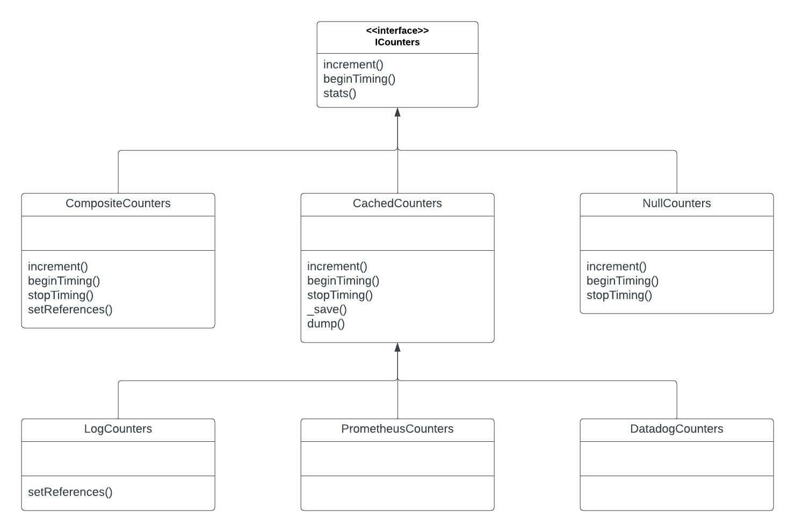
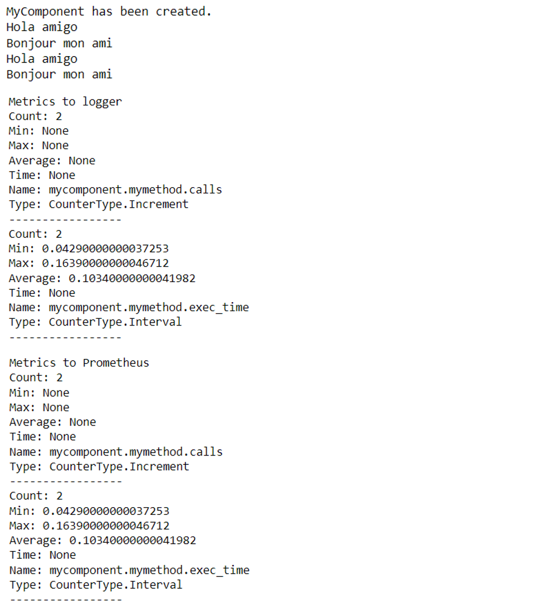



### Key takeaways

<table class="full-width-table">
  <tr>
    <td>Performance metrics</td>
    <td>Values that result from the measurement of an application's non-functional traits, which can provide useful insight into how the application performs.</td>
  </tr>
  <tr>
    <td>ICounters</td>
    <td>Interface that defines methods for performance counters that measure execution metrics.</td>
  </tr>
  <tr>
    <td>CachedCounters</td>
    <td>Performance counters that store their measurements in memory.</td>
  </tr>
  <tr>
    <td>LogCounters</td>
    <td>Performance counters that periodically send their measurements to a logger</td>
  </tr>
  <tr>
    <td>NullCounters</td>
    <td>Component that is used to create dummy performance counters.</td>
  </tr>
  <tr>
    <td>Performance metrics tools</td>
    <td>Tools used to analyze performance metrics. Examples are Prometheus and Datadog.</td>
  </tr>
  <tr>
    <td>CompositeCounters</td>
    <td>Component that is used to group counters from different components into a single one.</td>
  </tr>
</table>

### Introduction

This tutorial will teach you how to create and manage performance metrics with Pip.Services components. First, we will learn how counters are defined in the toolkit and how to add them to a component. Then, we will see several options to manage the obtained performance metrics, such as storing them in memory, showing them on a console, sending them to external tools, and grouping them in composite counters. We will also study a dummy component used to simulate counters.

### Counters

Pip.Services has the Count package within the Components module, which contains several interfaces and classes used to create performance metrics. 

Within these interfaces, ICounters defines methods for measuring execution performance. One of them is increment(), which increases by a defined value each time it is called. Other important methods are beginTiming() and stats(), which are used to calculate time intervals and common statistics (minimum, maximum, and average) respectively.

This interface is implemented by several classes. The figure below shows a simplified class diagram displaying the relationships between it and the main classes used to build different counters. These classes will be explained in more detail in the following sections.

The toolkit has several pre-defined counters, which are specified in the CounterType class. They are:

When working with counters, a best practice is to name them according to the following convention:

<service_or_component_name>.<method_name>.<counter_name>

### Managing counters

In the next sections, we will construct examples that show how to define counters and store them in memory, a logger, and external tools. We will also learn how to create a dummy component that has no real effect and a composite component that groups one or more different counters.
     
#### Monitored component

First, we define a class that has two performance metrics: the number of times a method is called and its execution time. Both metrics are part of a dummy function that simulates a task by printing two messages on our console. The code below shows what this class looks like:     


  



  



  Not available  



  



  



  Not available  

     
#### Counters

Once we have defined the performance metrics in our class, we need to expose the obtained values. This can be done in several ways, such as storing them in memory for later use, showing them on our console, or using an external tool for analysis such as Prometheus or Datadog

The following sections explain two components used for these purposes. The first is CachedCounters, which stores performance metrics in memory. The second is LogCounters, which sends the metrics to a logger. Then, they continue with NullCounters, a dummy component aimed at testing and modeling; and CompositeCounters, a component used to group several counters that collect the same metrics. We also mention some components capable of sending metrics to external tools.
     
     
##### CachedCounters
     
The CachedCounters class is used to create performance counters and store their values in memory. This is an abstract class that is generally used to implement other counters, such as LogCounters, PrometheusCounters and DatadogCounters. 

An important method defined in this class is save(), which is abstract and therefore it needs to be implemented by its subclasses. Another method in this class is dump(), which saves the metrics automatically.

In the example below, we use the previously defined component with CachedCounters. For this, we create a subclass of CachedCounters with a version of this method that simply prints a message. When developing microservices, it is within this method that we can define what we want to do with our performance values. 

Then, once we have our class with the CachedCounters included, we call myMethod(), get the counters, and print the results. The final code is:
     

  



  



  Not available  



  



  



  Not available  

     
Which after running, produces the following outcome:     
 
   
   
As we can see, the _save() method was called automatically. Additionally, the number of calls is an integer and has no values for minimum, maximum and average. Moreover, the execution time provides these statistics.     
     
##### LogCounters

We can also show the counters on our console. This can be done with the LogCounters class, which can be used to create performance counters that periodically dump the obtained measurements to a logger.

Containers consider LogCounters by default. Once we create a container, the container's factory will create a LogCounters component that uses the ConsoleLogger. Thus, all metrics defined within a component will reflect the measured values on console.

In our next example, we use the LogCounters class associated with the ConsoleLogger class. Then, we call myMethod() and analyze the results as we did in the previous example. The following code shows how to do this:
     

  



  



  Not available  



  



  



  Not available  
     
     
Which, after running, produces the following results:
     
 
 
As we can see, the main difference with the previous example is the presence of counters' information on our console. Otherwise, the results are the same.
 
##### NullCounters
     
If we are testing our application or want to create a prototype, we can use the NullCounters component, which is a dummy one and produces no real results. In this manner, we can simulate the existence of a counters component, without having to deal with it.

In this case, we need to delete the flush command from our component as there are no values to be saved. The following code shows how to do this:


  



  



  Not available  



  



  



  Not available  


Which after running produces the following outcome: 
 
 
 
##### Other counters

Performance counters can also be sent to different tools for their analysis. Pip.Services contains specific counters for the most common tools including [Prometheus](../prometheus/) and [Datadog](../datadog/).

##### CompositeCounters
     
Pip.Services offers the CompositeCounters component, which can be used to group a set of counters that collect the same performance metrics. Once collected, the metrics can be sent to different destinations, such as a console, a logger, or a tool like Prometheus or Datadog.

An important method in this class is setReferences(), which registers all components that will receive the measurements. When using a container, this method finds all registered counters and connects to them.

In the example below, we have a monitored class similar to the one from the previous section, except for the fact that considers a CompositeCounters component and adds a setReferences() method.

We can use this component to store metrics that can be used by, for example, a CachedLogger and a Prometheus component.

To achieve this, we define two counters, one that stores values in a CachedLogger and another that connects to Prometheus. Then, we instantiate our monitored class and add references to both counters. 
     
After running myMethod(), we obtain the performance metrics for CachedLogger and PrometheusCounters. 

The following code shows how this can be done:


  



  



  Not available  



  



  



  Not available  
     
     
Which, after running produces the following output:
     
 
 
### Wrapping up

In this tutorial, we have seen how to create, calculate, store and use performance metrics. We built an example where we created a call-counter and an execution time metric for a method, and saved the obtained values in memory, a logger, and a component that connects to Prometheus. We also learned how to create a NullCounters, which is a dummy component with no real effect that is useful for testing and modeling purposes. Finally, we understood how to group several counters via the CompositeCounters class and obtain the stored values via different tools for future use.     
     
