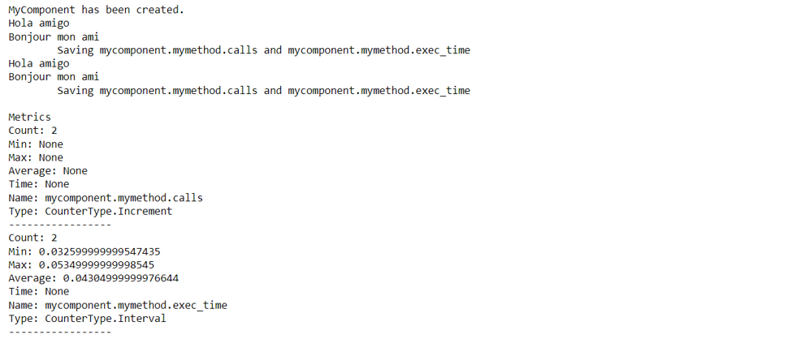
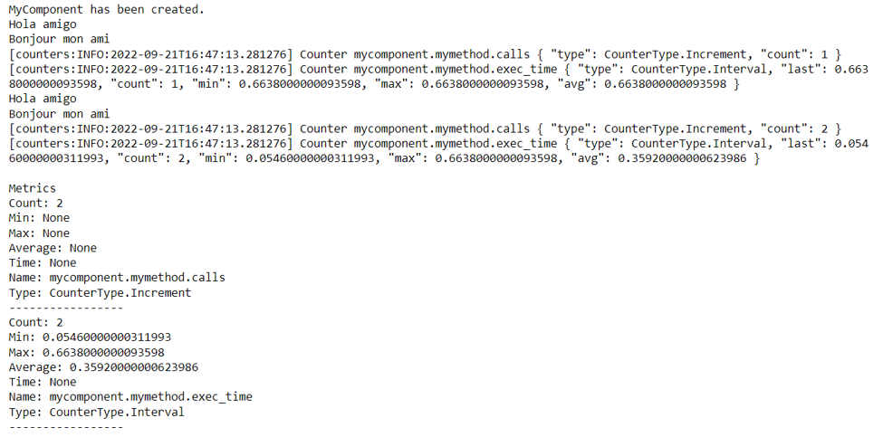



### Key takeaways

<table class="full-width-table">
  <tr>
    <td>Performance metrics</td>
    <td>Values that result from the measurement of an application's non-functional traits, which can provide useful insight into how the application performs.</td>
  </tr>
  <tr>
    <td>ICounters</td>
    <td>Interface that defines methods for performance counters that measure execution metrics.</td>
  </tr>
  <tr>
    <td>CachedCounters</td>
    <td>Performance counters that store their measurements in memory.</td>
  </tr>
  <tr>
    <td>LogCounters</td>
    <td>Performance counters that periodically send their measurements to a logger</td>
  </tr>
  <tr>
    <td>NullCounters</td>
    <td>Component that is used to create dummy performance counters.</td>
  </tr>
  <tr>
    <td>Performance metrics tools</td>
    <td>Tools used to analyze performance metrics. Examples are Prometheus and Datadog.</td>
  </tr>
  <tr>
    <td>CompositeCounters</td>
    <td>Component that is used to group counters from different components into a single one.</td>
  </tr>
</table>

### Introduction

This tutorial will teach you how to create and manage performance metrics using components from the Pip.Services toolkit. First, we will learn how counters are defined in the toolkit and how to add them to a component. Then, we will see several options of managing the obtained performance metrics, such as storing them in memory, showing them in the console, sending them to external tools, and grouping them into composite counters. We will also examine a dummy component that can be used to simulate counters.

### Counters

Pip.Services’ Components module includes a package called Count, which contains several interfaces and classes that can be used to create performance counters. 

Among these interfaces is one called ICounters, which defines methods for measuring execution performance. One such method is increment(), which increases by a defined value each time it is called. Other important methods are beginTiming() and stats(), which are used to calculate time intervals and common statistics (minimum, maximum, and average), respectively. There is no stopTiming() method in this interface due to the fact that beginTiming() is supposed to return a CounterTiming object, which can be called to end the measurement and update the counter.

The ICounters interface is implemented by several classes. The figure below shows a simplified class diagram, displaying the relationships between this interface and the main classes used to build counters. These classes will be explained in more detail in the following sections.

Pip.Services has several predefined counters, specified in the CounterType class. They are:

A best practice when working with counters is to name them using to the following convention:

<service_or_component_name>.<method_name>.<counter_name>

### Managing counters

In the next sections, we will construct examples that show how to define counters that will store their metrics in memory, in a logger, or in monitoring tools. We will also learn to create a dummy component that performs no real measurements and a composite counter component, capable of grouping multiple different counters into one.
     
#### Monitored component

First, we define a class that has two performance metrics: the number of times a method is called and its execution time. Both metrics will be performing measurements for a dummy function that simulates a task by printing two messages to the console. Finally, we call the dump() method to save the obtained values. The code below shows what this class looks like:


  



  



  Not available  



  



  



  Not available  

     
#### Counters

Once we have defined the performance metrics in our class, we need to make the obtained values available. This can be done in several ways, such as storing them in memory for later use, showing them in the console, or using an external tool like Prometheus or Datadog for metric analysis.

The following subsections aim to explain how different components can be used to achieve various results. First up will be CachedCounters, which stores performance metrics in memory. Second will be LogCounters, which sends metrics to a logger. After that will come NullCounters - a dummy component often used for testing and modeling purposes. A few components that are capable of sending metrics to external tools will also be briefly mentioned, and then we’ll wrap up the tutorial with CompositeCounters - a component that allows for counters that measure the same metrics but use them differently to be grouped into a single counter.
     
##### CachedCounters
     
The CachedCounters class is used to create performance counters and store their values in memory. This is an abstract class that is generally used to implement other counters, such as LogCounters, PrometheusCounters and DatadogCounters. 

An important method declared in this class is save(), which, as the name would suggest, saves the current counters’ measurements. This method is abstract and therefore needs to be implemented by all subclasses. Another notable method of this class is dump(), which saves metrics data at certain time intervals.

In the example below, we use the previously defined component with CachedCounters. For this, we create a subclass of CachedCounters with a version of the save() method that simply prints a message. When developing real microservices, it is within this method that we can define what we want to do with our performance metrics. 

Then, after passing an instance of our CachedCounters’ subclass (i.e. MyCachedCounters) to our component, we call the component’s myMethod(), get the counters, and print the results. The final code is:

     

  



  



  Not available  



  



  



  Not available  

     
Which, after running, produces the following output:  
 
   
   
As we can see, the save() method was called automatically. Since the Increment counter was only counting the number of times MyMethod was called, it returns the invocation count, but does not supply any statistics data (i.e. minimum, maximum, average). On the other hand, the Interval counter, which measures the execution time, does provide these statistics.
      
##### LogCounters

Counters can also be made to output their metrics to the console. This can be done with the LogCounters class, which can be used to create performance counters that periodically dump the obtained measurements to a logger.

Containers use LogCounters by default. Once we create a container, the container’s factory will create a LogCounters component, which uses the ConsoleLogger component. Thus, all component metrics measured by the counter will be outputted to the console.

In our next example, we use the LogCounters class, referencing the ConsoleLogger component as a dependency. Then, we call myMethod() and analyze the results as we did in the previous example. The following code shows how to do this:
   

  



  



  Not available  



  



  



  Not available  
     
     
Which, after running, produces the following results:
     
 
 
As we can see, the main difference from the previous example is the instantaneous and automatic printing of the counters’ measurements to the console. The remaining messages remained mostly unchanged.
 
##### NullCounters
     
If we are testing our application or want to create a prototype, we can use NullCounters, which is a dummy component and produces no real measurements. In this manner, we can simulate the existence of a counters component, without having to actually deal with one.

In this case, we need to delete the call to the counters’ dump() method from our component, as there will be no values to save. The resulting code should look like this:


  



  



  Not available  



  



  



  Not available  


Which, after running, produces the following outcome:

 
 
##### Other counters

Performance metrics can also be sent to monitoring tools, which specialize in processing and displaying metrics data. Pip.Services provides counters that can be used with some of the most popular monitoring tools, such as [Prometheus](../prometheus/) and [Datadog](../datadog/).

##### CompositeCounters
     
Pip.Services also offers the CompositeCounters component, which can be used to group counters that need to collect the same performance metrics, but use them differently. Once collected, the metrics can be sent to different destinations, such as a console, a logger, and/or a monitoring tool.

An important method declared in this class is setReferences(), which registers all components that will receive the measurements. When using a container, this method finds all registered counters and connects to them.

In the example below, we have a monitored class similar to the one from the previous section, except for the fact that it utilizes a CompositeCounters component and has a setReferences() method added to it.

We can use this component to store metrics in, for example, a CachedLogger and a Prometheus component.
To achieve this, we define two counters, a LogCounters component that stores values in a CachedLogger and PrometheusCounters component that connects to Prometheus. Then, we instantiate our monitored class and add references to both counters. 

After running myMethod(), we can print the performance metrics obtained by both counters, just like we were doing in the previous example. 
The following code shows how this can be done:


  



  



  Not available  



  



  



  Not available  
     
     
Which, after running, produces the following output:
     
 
 
### Wrapping up

In this tutorial, we have seen how to create, calculate, store and use performance metrics. We built an example where we created a call-counter and an execution time counter, added these metrics to one of our component’s methods, and saw how to save the obtained values to memory, a logger, and/or a component that connects to Prometheus. We also learned how to create NullCounters, which is a dummy component that performs no real measurements, but is useful for testing and modeling purposes. Finally, we understood how to group several counters via the CompositeCounters class and send the measured values to other tools for future use.
   
     
