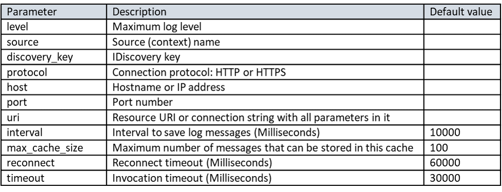
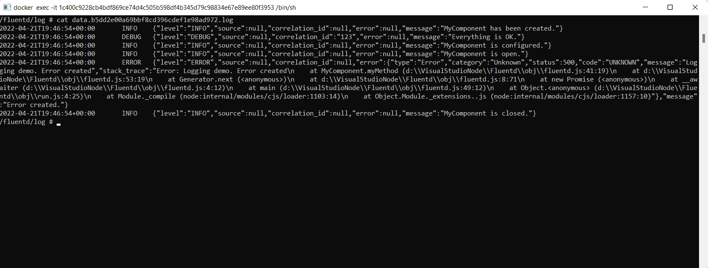



### Key takeaways

### Introduction

In this tutorial, you will learn how to use the FluentdLogger component to send log messages to Fluentd. First, we will describe this component and understand its pre-requisites. Then, we will create a custom component with methods that generate log messages every time they are called, run it and see the messages received by Fluentd. Finally, we will combine the different code sections into one program and summarize what we have learned.

### FluentdLogger

This component provides a tool to send log messages to Fluentd. It extends the CachedLogger class and, at present, doesn’t support authorization. The next sections explain its main methods and how to verify that log messages have been received by Fluentd.

#### Pre-requisites

In order to use this component, we need to import it first. The following code shows how to do this:


   



 Not available  



 Not available  



  Not available  



  Not available  



  Not available  


#### Creating a component with a logger

Now that we have imported our Fluentd logger, we can create a custom component that uses it. In our example, we define a custom component that is configurable, openable, and closeable. Thus, we add the IConfigurable and IOpenable interfaces. 

Then, we define a logger as an instance of the FluentdLogger class and configure it. The main configuration parameters available from this class are:

After this, we set the logging level we want (in our example level 5 or DEBUG) and connect our component to Fluentd via the open() method.

Finally, we add a custom method with an artificial problem and logging messages for the different methods. The resulting code is:


   



 Not available  



 Not available  



  Not available  



  Not available  



  Not available  


#### Generating logs

Now that we have a component with logging capabilities, we create an instance of it and call the different methods. In this manner, we generate log messages that are sent to Fluentd. The following code is an example of how to do this:


   



 Not available  



 Not available  



  Not available  



  Not available  



  Not available  


#### Our logs in Fluentd

We can see the results on the Fluentd log files, usually located in the fluentd/log directory. The following picture shows the results obtained after running the code shown in the previous sections.

#### Final code

Our last step is to combine all the code from the previous sections into one program. The code below is the result of this operation:


   



 Not available  



 Not available  



  Not available  



  Not available  



  Not available  


### Wrapping up

In this tutorial, we have seen how to use the FluentdLogger class to send log messages to Fluentd. We started by learning the pre-requisites. Then, we created a custom component with methods that send different log messages via the FluentdLogger class, and run them. Finally, we saw the messages received by Fluentd and compiled the code into one program.
